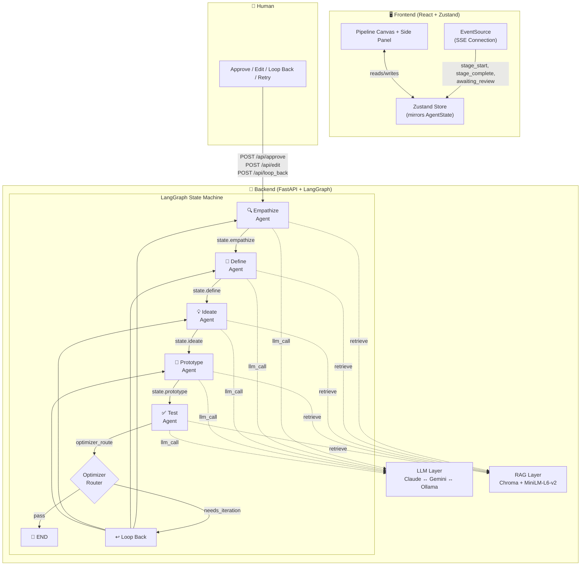
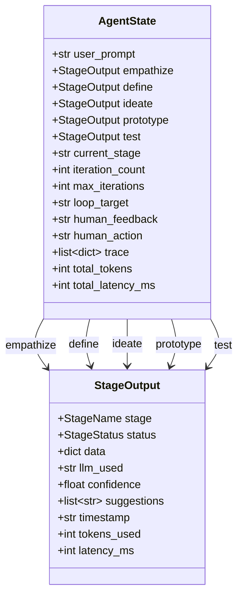
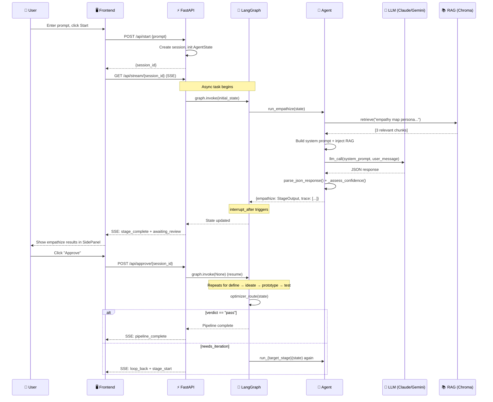
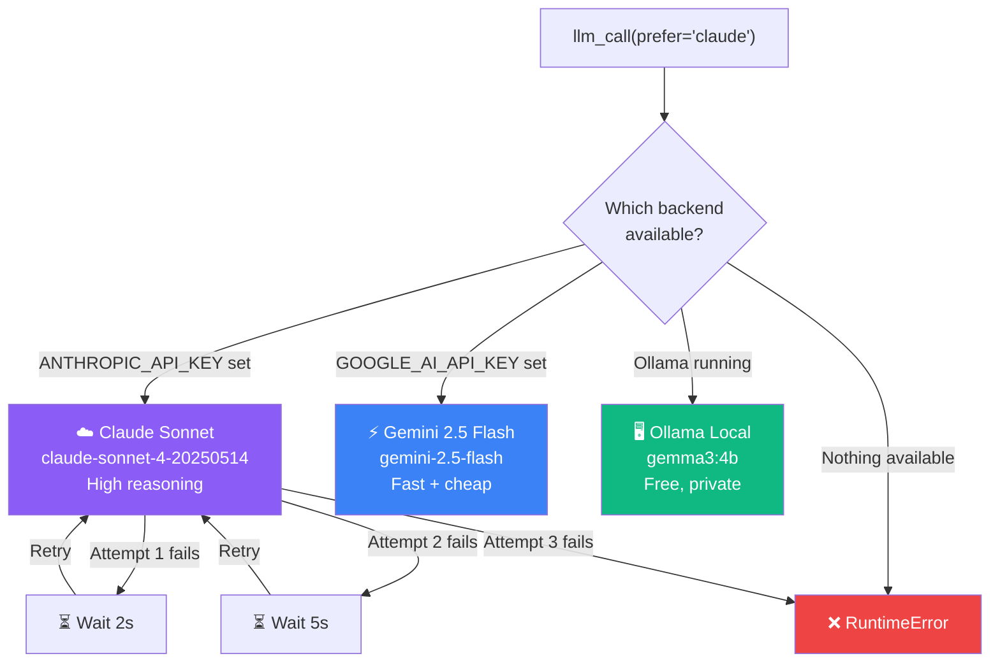
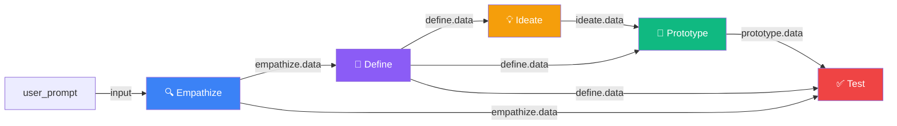

# Agentic Design Co-Pilot — Full Architecture Deep-Dive

## 1. System Overview

The system is a **5-agent linear pipeline** orchestrated by LangGraph, with human-in-the-loop (HITL) gates after every stage. Agents don't talk to each other directly — they communicate through a **shared state object** ([AgentState](file:///Users/veesu/design-ops-v2/backend/app/state.py#33-60)) that flows through the graph.



---

## 2. The Shared Brain: [AgentState](file:///Users/veesu/design-ops-v2/backend/app/state.py#33-60)

Every agent reads from and writes to a single **flat TypedDict**. This is the sole communication mechanism — there is no direct agent-to-agent messaging.



> **Key insight**: Each agent writes ONLY to its own stage key (`state["empathize"]`, `state["define"]`, etc.) and reads from upstream stages. The `trace` list uses a LangGraph `operator.add` reducer — each agent appends to it without overwriting previous entries.

---

## 3. Agent-by-Agent Deep Dive

### 🔍 Agent 1: Empathize — "The Researcher"

| Attribute | Value |
|---|---|
| **File** | [empathize.py](file:///Users/veesu/design-ops-v2/backend/app/agents/empathize.py) |
| **LLM** | Claude Sonnet (preferred), Gemini Flash (fallback) |
| **Temperature** | 0.3 (conservative — factual) |
| **Max Tokens** | 2,048 |
| **Reads** | `state["user_prompt"]` |
| **Writes** | `state["empathize"]`, `state["trace"]`, `state["total_tokens"]` |
| **RAG Query** | `"empathy map persona user research {prompt[:100]}"` |

**How it thinks:**
1. Receives the raw user prompt (e.g., "Design a dashboard for busy project managers")
2. Queries RAG for empathy map templates and persona examples from the knowledge base
3. Constructs a system prompt channeling Stanford d.school's Empathize principles + IBM's "Focus on user outcomes"
4. Makes a **single LLM call** to generate all artifacts at once
5. Parses the JSON response and wraps it in a [StageOutput](file:///Users/veesu/design-ops-v2/frontend/src/types/index.ts#3-14)

**What it produces:**
```json
{
  "user_needs": ["3-5 core needs"],
  "pain_points": ["3-5 frustrations"],
  "empathy_map": { "thinks": [], "feels": [], "says": [], "does": [] },
  "persona": { "name": "", "role": "", "goals": [], "frustrations": [] },
  "research_notes": "narrative summary"
}
```

**Limitations**: Single LLM call, no web search, one persona only, no journey mapping.

---

### 🎯 Agent 2: Define — "The Strategist"

| Attribute | Value |
|---|---|
| **File** | [define.py](file:///Users/veesu/design-ops-v2/backend/app/agents/define.py) |
| **LLM** | Claude Sonnet (preferred) |
| **Temperature** | 0.3 |
| **Max Tokens** | 2,048 |
| **Reads** | `state["empathize"]["data"]` |
| **Writes** | `state["define"]` |
| **RAG Query** | `"HMW questions How Might We IBM Hills POV statement problem definition"` |

**How it thinks:**
1. Takes the empathize output and serializes it as JSON into the user message
2. Retrieves HMW templates, Hills format examples, and POV patterns from RAG
3. Synthesizes research into a structured problem frame
4. Applies IBM Hills format (Who/What/Wow)

**What it produces:**
```json
{
  "pov_statement": "[User] needs [need] because [insight]",
  "hmw_questions": ["How might we..."],
  "hills": [{ "who": "", "what": "", "wow": "" }],
  "constraints": ["technical/business constraints"],
  "success_metrics": ["measurable outcomes"],
  "guardrails": ["what we will NOT do"]
}
```

**Key pattern**: This agent is pure synthesis — it transforms qualitative research into actionable frames.

---

### 💡 Agent 3: Ideate — "The Creative"

| Attribute | Value |
|---|---|
| **File** | [ideate.py](file:///Users/veesu/design-ops-v2/backend/app/agents/ideate.py) |
| **LLM** | **Gemini Flash** (preferred — faster, more creative) |
| **Temperature** | **0.7** (high — wants diversity) |
| **Max Tokens** | 4,096 (larger — SVG wireframes are verbose) |
| **Reads** | `state["define"]["data"]` |
| **Writes** | `state["ideate"]` |
| **RAG Query** | `"React component patterns design tokens UI wireframe layout"` |

**How it thinks:**
1. Reads the problem definition (POV, HMW questions, constraints)
2. Retrieves UI patterns and design system tokens from RAG
3. Uses **high temperature (0.7)** to encourage divergent thinking
4. Generates 3-5 distinct design variants with SVG wireframes
5. Recommends one variant with rationale

**What it produces:**
```json
{
  "variants": [{
    "id": "variant_1",
    "name": "Card Grid Dashboard",
    "description": "...",
    "approach": "how it solves HMW",
    "sketch_svg": "<svg viewBox='0 0 400 300'>...</svg>",
    "pros": [], "cons": []
  }],
  "selected_variant": "variant_1",
  "selection_rationale": "..."
}
```

**Why Gemini Flash?** Speed + creativity. Ideation benefits from volume, not precision.

---

### 🔧 Agent 4: Prototype — "The Builder"

| Attribute | Value |
|---|---|
| **File** | [prototype.py](file:///Users/veesu/design-ops-v2/backend/app/agents/prototype.py) |
| **LLM** | **Gemini Flash** (preferred — fast code gen) |
| **Temperature** | **0.2** (low — wants correctness) |
| **Max Tokens** | 4,096 |
| **Reads** | `state["ideate"]["data"]`, `state["define"]["data"]` |
| **Writes** | `state["prototype"]` |
| **RAG Query** | `"Tailwind CSS React component accessibility ARIA keyboard navigation"` |
| **Post-processing** | Regex-based markdown/import/export stripping |

**How it thinks:**
1. Finds the selected variant from ideate output
2. Retrieves Tailwind patterns and accessibility rules from RAG
3. Generates a **self-contained React component** (no imports/exports — react-live compatible)
4. **Post-processes** the code: strips markdown fences, import statements, export keywords
5. Validates the component name is `PrototypeComponent`

**What it produces:**
```json
{
  "component_code": "function PrototypeComponent() { ... }",
  "component_name": "PrototypeComponent",
  "props_interface": "interface Props { ... }",
  "usage_example": "<PrototypeComponent />",
  "dependencies": [],
  "design_decisions": ["reasons for implementation choices"]
}
```

**Unique**: This is the only agent with **post-processing logic** (regex cleanup) because LLMs frequently ignore "no imports" instructions.

---

### ✅ Agent 5: Test — "The Critic"

| Attribute | Value |
|---|---|
| **File** | [test.py](file:///Users/veesu/design-ops-v2/backend/app/agents/test.py) |
| **LLM** | Claude Sonnet (preferred — careful reasoning) |
| **Temperature** | 0.3 |
| **Max Tokens** | 3,072 |
| **Reads** | `state["prototype"]["data"]`, `state["define"]["data"]`, `state["empathize"]["data"]` |
| **Writes** | `state["test"]` |
| **RAG Query** | `"WCAG 2.1 AA accessibility checklist color contrast keyboard usability heuristics"` |

**How it thinks:**
1. Reads the **component code**, **design decisions**, **original user needs**, **POV statement**, and **Hills**
2. Retrieves WCAG accessibility rules from RAG
3. Evaluates against 5 criteria: WCAG audit, code quality, user needs, POV alignment, Hills coverage
4. Produces a verdict: `pass` / `needs_iteration` / `fail`
5. If not passing, recommends which stage to loop back to

**What it produces:**
```json
{
  "wcag_audit": { "passed": [], "failed": [], "warnings": [], "score": 0.85 },
  "performance_notes": ["code quality observations"],
  "ux_evaluation": { "meets_needs": "...", "matches_pov": "...", "hits_hills": "..." },
  "overall_score": 0.82,
  "verdict": "pass | fail | needs_iteration",
  "fix_suggestions": ["specific fixes"],
  "loop_recommendation": { "should_loop": false, "target_stage": "ideate", "reason": "..." }
}
```

**Unique**: This is the **only cross-referencing agent** — it reads from 3 upstream stages (empathize, define, prototype) to evaluate holistically.

---

## 4. The Communication Pattern



---

## 5. LLM Routing: Three-Tier Fallback



**Per-agent LLM preferences:**

| Agent | Preferred LLM | Why |
|---|---|---|
| Empathize | Claude | Nuanced empathy reasoning |
| Define | Claude | Strong synthesis and logic |
| Ideate | **Gemini Flash** | Speed + creative diversity |
| Prototype | **Gemini Flash** | Fast code generation |
| Test | Claude | Careful critical evaluation |

---

## 6. RAG: Knowledge Grounding

Each agent constructs a **stage-specific RAG query** to retrieve relevant knowledge.

| Agent | RAG Query | Retrieved Knowledge Files |
|---|---|---|
| Empathize | `"empathy map persona user research..."` | [empathy-map-template.md](file:///Users/veesu/design-ops-v2/backend/knowledge/empathy-map-template.md), [stanford-design-thinking.md](file:///Users/veesu/design-ops-v2/backend/knowledge/stanford-design-thinking.md) |
| Define | `"HMW questions Hills POV statement..."` | [hmw-question-patterns.md](file:///Users/veesu/design-ops-v2/backend/knowledge/hmw-question-patterns.md), [ibm-hills-template.md](file:///Users/veesu/design-ops-v2/backend/knowledge/ibm-hills-template.md) |
| Ideate | `"React component patterns design tokens..."` | [react-component-patterns.md](file:///Users/veesu/design-ops-v2/backend/knowledge/react-component-patterns.md), [tailwind-design-tokens.md](file:///Users/veesu/design-ops-v2/backend/knowledge/tailwind-design-tokens.md) |
| Prototype | `"Tailwind CSS React accessibility ARIA..."` | [react-component-patterns.md](file:///Users/veesu/design-ops-v2/backend/knowledge/react-component-patterns.md), [wcag-keyboard-navigation.md](file:///Users/veesu/design-ops-v2/backend/knowledge/wcag-keyboard-navigation.md) |
| Test | `"WCAG 2.1 AA accessibility checklist..."` | [wcag-2.1-aa-checklist.md](file:///Users/veesu/design-ops-v2/backend/knowledge/wcag-2.1-aa-checklist.md), [wcag-color-contrast.md](file:///Users/veesu/design-ops-v2/backend/knowledge/wcag-color-contrast.md), [ui-heuristics.md](file:///Users/veesu/design-ops-v2/backend/knowledge/ui-heuristics.md) |

RAG returns the **top 3 chunks** per query, which are injected into the system prompt under a `{rag_context}` placeholder.

---

## 7. Optimizer: The Decision Brain

The optimizer is **NOT an agent** — it's a pure function ([optimizer_route](file:///Users/veesu/design-ops-v2/backend/app/graph.py#25-56)) that runs as a LangGraph **conditional edge** after the Test node.

```mermaid
graph TD
    T["Test Agent Output"] --> V{verdict?}
    
    V -->|"pass"| END["🏁 END<br/>Pipeline Complete"]
    V -->|"fail" / "needs_iteration"| ITR{iteration_count<br/>>= max_iterations?}
    
    ITR -->|Yes, maxed out| END
    ITR -->|No, can loop| LOOP{loop_recommendation<br/>.should_loop?}
    
    LOOP -->|Yes + target_stage| TARGET["↩ Route to<br/>target_stage"]
    LOOP -->|No target| PROTO["↩ Default to<br/>Prototype"]
    
    TARGET --> E["Empathize"]
    TARGET --> D["Define"]
    TARGET --> I["Ideate"]
    TARGET --> P["Prototype"]
    PROTO --> P

    style END fill:#10b981,color:#fff
    style TARGET fill:#8b5cf6,color:#fff
    style PROTO fill:#f59e0b,color:#fff
```

---

## 8. Data Dependencies: Who Reads What



> **Note:** The Test agent is the only one that reads from **3 upstream stages** (empathize + define + prototype). The Prototype agent reads from **2** (ideate + define). All others read from exactly **1** upstream stage.

---

## 9. What's Missing (vs. the PRD)

| Current State | PRD Requirement | Gap |
|---|---|---|
| Single LLM call per stage | Multi-agent sub-swarm per stage | No sub-agents |
| Static RAG (10 markdown files) | Live web search + competitor analysis | No live data |
| 1 persona per run | 2-3 OCEAN-calibrated synthetic personas | Single persona |
| No interviews | Planner→Interviewer→Critic triad | No synthetic interviews |
| Empathy map only | Empathy maps + journey maps + affinity clusters | Limited artifacts |
| No automation levels | Auto / Guided / Manual modes | Single mode |
| Agents share state only | "Agentic mesh" with S2A communication | No direct agent talk |
| `operator.add` trace only | Full semantic diffs + decision traces | Basic tracing |
