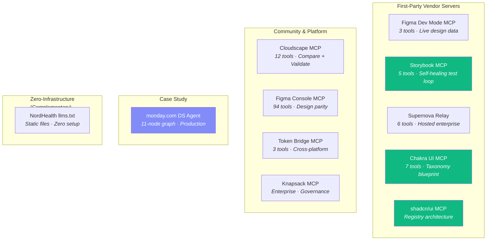
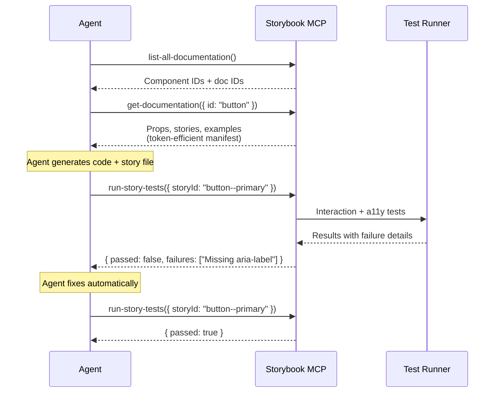
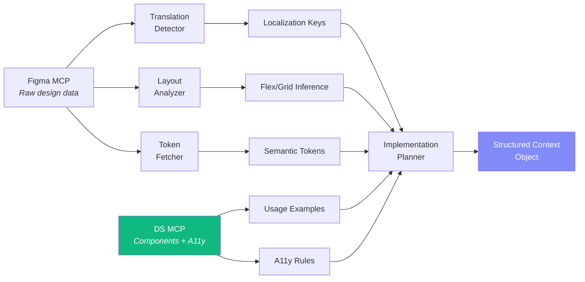
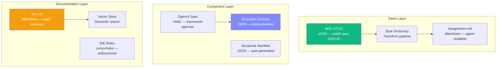
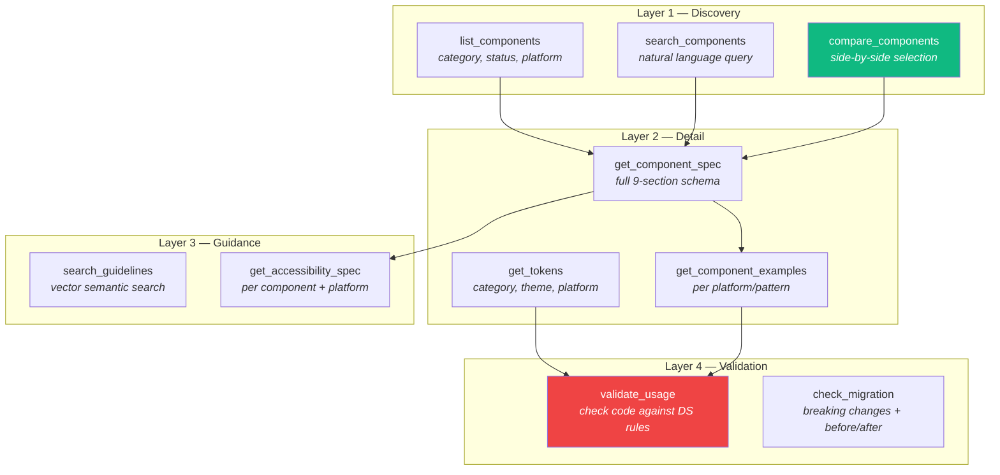
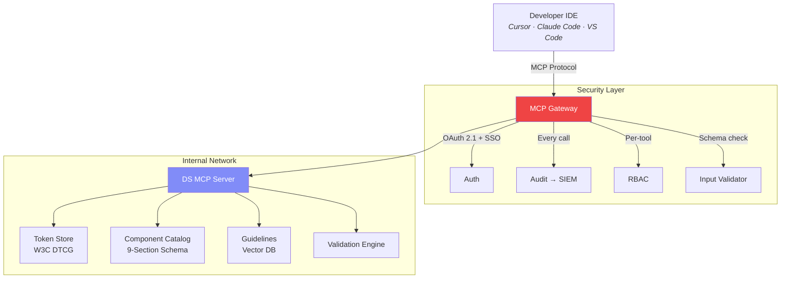
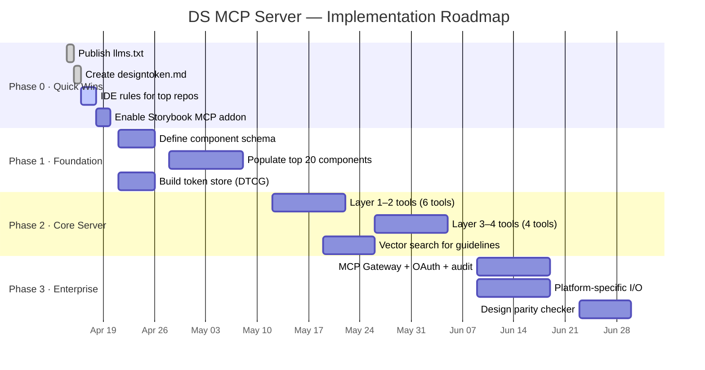

# MCP Servers for Design Systems

## Competitive Audit & Architecture Guide

 

|             |                                           |
|-------------|-------------------------------------------|
|**Version**  |4.0 — Final                                |
|**Date**     |April 2026                                 |
|**Status**   |Draft for Team Review                      |
|**Scope**    |10 implementations · 10 weighted dimensions|
|**Platforms**|Web · iOS · Android                        |

 

-----

 

# Part I — Summary & Context

 

## 1. Executive Summary

AI agents are the newest consumers of design systems. When agents have structured, machine-readable access to component specs, tokens, and guidelines, the quality of generated code improves dramatically — Figma’s 2025 data showed **43% better code accuracy** with semantic token names.

This audit examined **10 MCP server implementations** to answer three questions:

**① What tools should a DS MCP server expose?**
How should inputs and outputs be designed for maximum agent effectiveness?

**② What format should machine-readable DS specs take?**
How should tokens, components, guidelines, and accessibility rules be structured?

**③ What architecture works at enterprise scale?**
How should the server be deployed, secured, and kept in sync across platforms?

 

### Three Strategic Findings

|#    |Finding                                                                          |What It Means                                                                                 |
|:---:|---------------------------------------------------------------------------------|----------------------------------------------------------------------------------------------|
|**1**|No server implements the full component schema with `aiHints` and `antiPatterns` |**First-mover opportunity** — define the standard for AI-ready design systems                 |
|**2**|The “returns context, not code” principle is essential for multi-platform systems|MCP provides structured knowledge; each platform’s agent generates platform-native code       |
|**3**|7 well-designed tools outperform 94 granular ones                                |Progressive disclosure (list → detail → examples) matches how developers actually explore a DS|

 

### Recommendation

Build a custom MCP server with **10 tools** in 4 progressive disclosure layers, using the **9-section component metadata schema** enriched with `aiHints` and `antiPatterns`. Start with **zero-infrastructure quick wins this week** (llms.txt, token spec files, IDE rules) while the server is built over 6–8 weeks.

 

-----

 

## 2. How to Read This Report

This report uses a **pyramid structure** — each layer adds depth. Stop at any level and you have a complete picture at that resolution.

|Layer         |Sections                                         |Read Time|You’ll Get                                    |
|--------------|-------------------------------------------------|---------|----------------------------------------------|
|**Skim**      |§1 Executive Summary + §14 Decision Brief        |5 min    |The recommendation and three decisions to make|
|**Understand**|+ §3 Landscape + §4 Score Matrix                 |15 min   |How all 10 implementations compare            |
|**Evaluate**  |+ §5 Server Deep Dives (read 3–4 most relevant)  |30 min   |Tool I/O design patterns and real examples    |
|**Implement** |+ §6 Spec Formats + §7 Tool Taxonomy + §9 Roadmap|60 min   |Enough to start building                      |
|**Govern**    |+ §8 Security + §10 Risk Register                |75 min   |Enterprise deployment guidance                |

 

### Formatting Conventions

Throughout this report:

- **Blockquotes** (>) contain anticipated questions with answers
- **Bold text** highlights key terms on first use
- **Tables** are used for all comparative data
- **Mermaid diagrams** show architecture and flows
- **Code blocks** show specification formats and tool I/O examples
- Section summaries appear in bordered blocks at the end of dense sections

 

-----

 

## 3. Audit Methodology

### 3.1 What Was Evaluated

10 implementations spanning five categories: first-party vendor servers (5), community-built servers (3), enterprise case studies (1), and enterprise platforms (1). Each was evaluated on **documented capabilities** — tool surface area, schema richness, I/O design quality, and production evidence.

### 3.2 Scoring Dimensions

Scores are **1–10 per dimension**. Weights reflect priorities for a multi-platform enterprise design system.

|Dimension           |Wt    |What It Measures                                                                         |
|--------------------|:----:|-----------------------------------------------------------------------------------------|
|Token Coverage      |9     |W3C DTCG support, Figma Variables, multi-theme, multi-platform, deep reference resolution|
|Component Depth     |9     |Props, variants, composition rules, slots, platform-specific behavior                    |
|**Accessibility**   |**10**|ARIA roles, keyboard patterns, WCAG contrast, touch targets, screen reader guidance      |
|Agent Ergonomics    |8     |Tool naming, description quality, token-efficient payloads, progressive disclosure       |
|Extensibility       |7     |Custom tools, custom metadata, plugin architecture, webhooks                             |
|Docs & Guidelines   |8     |Usage guidelines, do’s/don’ts, anti-patterns, searchable docs                            |
|Versioning          |7     |Version-aware URIs, migration tools, changelog, breaking change detection                |
|**Enterprise Ready**|**9** |OAuth 2.1, SSO, RBAC, audit trails, hosted deployment, compliance                        |
|Ecosystem           |6     |IDE support (Cursor, VS Code, Claude Code), agent framework compatibility                |
|Code Gen Quality    |8     |Quality of generated output, examples, validation, test integration                      |

*Accessibility carries the highest weight (10) because regulated industries must produce accessible output by default. Non-compliant generated code means the DS has failed its primary purpose.*

### 3.3 Accuracy & Known Limitations

|What                             |Confidence    |Notes                                         |
|---------------------------------|:------------:|----------------------------------------------|
|Tool names, APIs, transport types|✅ High        |From official docs, npm, GitHub               |
|Source links, auth mechanisms    |✅ High        |Verified against published docs               |
|Numerical scores (1–10)          |⚠️ Directional |Subjective — treat as ±2; validate with PoC   |
|Quantified benefits              |⚠️ Extrapolated|From vendor claims, not independently measured|
|Security risk data               |✅ High        |From OWASP MCP Top 10 and published CVEs      |

**Not included:** Hands-on runtime testing, developer interviews, platform-specific (iOS/Android) validation.

> **Q: How should we validate these scores?**
> Install Chakra UI MCP in Cursor (`npx -y @chakra-ui/react-mcp`), build a simple form, and compare the experience with and without MCP. This 15-minute test validates “agent ergonomics” and “code gen quality” empirically.

 

-----

 

# Part II — Landscape & Comparison

 

## 4. Ecosystem Map



 

## 5. Master Comparison

|Server             |Type          |Tools    |Transport  |Auth     |Differentiator               |W.Score|
|-------------------|--------------|:-------:|-----------|---------|-----------------------------|:-----:|
|monday.com DS Agent|Case Study    |3 + graph|HTTP       |SSO      |Returns context, not code    |**7.7**|
|Supernova Relay    |1st Party SaaS|6        |HTTP hosted|OAuth+SSO|Full DS in one server        |**7.5**|
|Chakra UI MCP      |1st Party     |7        |Stdio      |API Key  |Tool taxonomy blueprint      |**7.1**|
|Knapsack MCP       |Platform      |Beta     |HTTP       |OAuth+SSO|Governance + ingestion engine|**6.5**|
|shadcn/ui MCP      |1st Party     |4        |Stdio      |None     |Multi-registry architecture  |**6.3**|
|Figma Dev Mode MCP |1st Party     |3        |Stdio+HTTP |OAuth    |Live Figma data + auto-rules |**6.1**|
|Cloudscape MCP     |Community     |12       |Stdio      |None     |Compare + validate (unique)  |**5.9**|
|Storybook MCP      |1st Party     |5        |HTTP local |None     |Self-healing test loop       |**5.8**|
|Figma Console MCP  |Community     |94       |Stdio+SSE  |Plugin   |Design parity checker        |**5.8**|
|Token Bridge MCP   |Community     |3        |Stdio      |None     |Cross-platform translation   |**4.3**|

 

## 6. Score Matrix

|Server       |Token|Comp |A11y |Agent|Ext   |Docs |Ver  |Ent  |Eco  |CdGen|**W.Avg**|
|-------------|:---:|:---:|:---:|:---:|:----:|:---:|:---:|:---:|:---:|:---:|:-------:|
|monday.com   |8    |9    |**9**|9    |7     |8    |5    |8    |5    |**9**|**7.7**  |
|Supernova    |**9**|8    |6    |8    |5     |**9**|7    |**9**|7    |7    |**7.5**  |
|Chakra UI    |6    |8    |7    |**9**|5     |7    |**9**|5    |6    |8    |**7.1**  |
|Knapsack     |6    |7    |7    |7    |6     |7    |5    |**9**|5    |6    |**6.5**  |
|shadcn/ui    |5    |7    |5    |8    |**9** |6    |6    |4    |8    |7    |**6.3**  |
|Figma Dev    |7    |6    |3    |9    |4     |3    |4    |8    |**9**|8    |**6.1**  |
|Cloudscape   |2    |**9**|6    |9    |8     |8    |3    |4    |4    |7    |**5.9**  |
|Storybook    |2    |7    |5    |8    |6     |5    |3    |5    |8    |8    |**5.8**  |
|Figma Console|7    |7    |4    |6    |**10**|5    |3    |4    |7    |6    |**5.8**  |
|Token Bridge |9    |1    |7    |6    |5     |2    |4    |3    |5    |5    |**4.3**  |

*Weighted average = Σ(score × weight) ÷ Σ(weight). Highest per dimension shown in bold.*

> **Q: Why is monday.com ranked first when it’s not open-source?**
> Because it scores highest on the dimensions that matter most: accessibility (9), component depth (9), agent ergonomics (9), code gen quality (9). The value is in the **architecture patterns**, not the code. Every other server in this audit provides code we can study; monday.com provides the blueprint we should target.

 

-----

 

# Part III — Server Deep Dives

Each profile follows the same template: what it does, how tools are designed (inputs and outputs), strengths, gaps, and the key takeaway for our architecture.

 

## 7. First-Party Servers

 

### 7.1 Chakra UI MCP — The Tool Taxonomy Blueprint

|             |                                                    |
|-------------|----------------------------------------------------|
|**Source**   |https://chakra-ui.com/docs/get-started/ai/mcp-server|
|**Package**  |`@chakra-ui/react-mcp`                              |
|**Transport**|Stdio · **License:** MIT                            |

 

**Why it matters:** Chakra UI has the best-designed tool taxonomy in the ecosystem. Its 7 tools demonstrate **progressive disclosure** — agents load detail only when needed, reducing token waste by 40–60% compared to dumping entire docs into context.

**Tool I/O design:**

|Layer    |Tool                      |Input                     |Output                                            |
|---------|--------------------------|--------------------------|--------------------------------------------------|
|Discovery|`list_components`         |*(none)*                  |Array of component names                          |
|Detail   |`get_component_props`     |`{ component: "Button" }` |Typed props: type, options, defaults, descriptions|
|Examples |`get_component_example`   |`{ component: "Button" }` |Code snippets with usage context                  |
|Theming  |`get_theme`               |*(none)*                  |Full token system (semantic tokens, text styles)  |
|Theming  |`theme_customization`     |`{ tokens: {...} }`       |Modified theme output **(write operation)**       |
|Migration|`v2_to_v3_code_review`    |`{ code: "..." }`         |Before/after code with change explanations        |
|Templates|`list_component_templates`|*(none, API key required)*|Pro template catalog                              |

**Example output — `get_component_props("Button")`:**

```json
{
  "variant": {
    "type": "enum",
    "options": ["solid", "outline", "ghost", "plain"],
    "default": "solid",
    "description": "The visual style of the button"
  },
  "size": {
    "type": "enum",
    "options": ["xs", "sm", "md", "lg"],
    "default": "md"
  },
  "loading": { "type": "boolean" },
  "disabled": { "type": "boolean" }
}
```

**Strengths:** Progressive disclosure minimizes token waste. Migration tool with before/after code is unique and high-value. `theme_customization` is a write tool — agents can create tokens, not just read.

**Gaps:** No `aiHints` (when to use which variant). No `antiPatterns`. No accessibility metadata. No cross-platform output.

> **Key takeaway:** This is the tool taxonomy to adopt. Extend with `search_guidelines`, `validate_usage`, `get_accessibility_spec`, and `compare_components`.

 

-----

 

### 7.2 shadcn/ui MCP — Registry Architecture *(New)*

|             |                              |
|-------------|------------------------------|
|**Source**   |https://ui.shadcn.com/docs/mcp|
|**Package**  |`@shadcn/ui` (CLI built-in)   |
|**Transport**|Stdio · **License:** MIT      |

 

**Why it matters:** shadcn/ui is the most popular component library in the React ecosystem (2025–2026). Its MCP server introduces a unique **multi-registry architecture** — one server connects to multiple component sources (public, private, third-party) and lets agents browse, search, and install components via natural language.

**Tool I/O design:**

|Tool               |Input                                            |Output                                         |
|-------------------|-------------------------------------------------|-----------------------------------------------|
|`search_registry`  |`{ query: "login form", registry?: "@internal" }`|Matching components across registries          |
|`browse_registry`  |`{ registry?: "@acme" }`                         |Full component catalog from a specific registry|
|`view_component`   |`{ name: "button", registry?: "@internal" }`     |Component schema, dependencies, code           |
|`install_component`|`{ name: "button", registry?: "@internal" }`     |Installs to project **(write operation)**      |

**The multi-registry pattern:**

```json
{
  "registries": {
    "@acme": "https://registry.acme.com/{name}.json",
    "@internal": {
      "url": "https://internal.company.com/{name}.json",
      "headers": { "Authorization": "Bearer ${REGISTRY_TOKEN}" }
    }
  }
}
```

The agent queries across all registries simultaneously. For a multi-platform DS, this maps to:

|Registry     |Purpose                              |
|-------------|-------------------------------------|
|`@ds/web`    |Web components (React)               |
|`@ds/ios`    |iOS components (SwiftUI wrappers)    |
|`@ds/android`|Android components (Compose wrappers)|
|`@ds/tokens` |Cross-platform design tokens         |

**Strengths:** Multi-registry architecture is unique — no other MCP server does this. Private registry support with auth headers. **Skills system** auto-detects project config via `shadcn info --json` (framework, Tailwind version, installed components). Massive ecosystem adoption.

**Gaps:** No accessibility metadata. No usage guidelines or anti-patterns. No migration tools. Web-only (React/Next.js).

> **Key takeaway:** The registry architecture is the novel pattern here. A DS MCP server could expose platform-specific registries that agents query based on context — the same `search` tool returns React components for web projects and SwiftUI components for iOS projects.

 

-----

 

### 7.3 Storybook MCP — Self-Healing Quality Loop

|             |                                             |
|-------------|---------------------------------------------|
|**Source**   |https://storybook.js.org/docs/ai/mcp/overview|
|**Package**  |`@storybook/addon-mcp`                       |
|**Transport**|HTTP (localhost:6006/mcp) · **License:** MIT |

 

**Why it matters:** Storybook’s MCP is fundamentally different — it’s not just a knowledge server, it’s a **feedback loop**. The agent generates code, writes stories, runs tests, sees failures, fixes them, and re-runs. Benchmarks show agents using this loop produce mergeable code with fewer tokens.

**Tool I/O flow:**



**Component Manifest format** (what `get-documentation` returns):

```json
{
  "Button": {
    "id": "button",
    "props": {
      "variant": { "type": "enum", "options": ["cta", "primary", "secondary"] },
      "disabled": { "type": "boolean", "default": false }
    },
    "stories": [
      { "id": "button--primary", "name": "Primary",
        "snippet": "<Button variant=\"primary\">Submit</Button>" }
    ],
    "docsUrl": "/docs/button--docs"
  }
}
```

**Strengths:** Self-healing loop is the most sophisticated quality mechanism. AGENTS.md template enforces “never hallucinate props.” Storybook composition lets agents access components from multiple composed Storybooks.

**Gaps:** No design tokens. React-only (preview). No anti-patterns or aiHints. Requires running Storybook dev server.

> **Key takeaway:** It’s not enough to give agents knowledge — you need a feedback loop that catches what they get wrong. For multi-platform DS, the test loop should include platform-specific checks (touch target size for iOS/Android, keyboard navigation for web).

 

-----

 

### 7.4 Supernova Relay — Enterprise Hosting Pattern

|             |                                                                                               |
|-------------|-----------------------------------------------------------------------------------------------|
|**Source**   |https://learn.supernova.io/latest/design-systems/getting-started/mcp-for-design-system-LIHAMhjr|
|**Transport**|HTTP hosted (mcp.supernova.io) · **Auth:** OAuth 2.1 + SSO                                     |

 

**Why it matters:** The most comprehensive single server — tokens, components, docs, and Storybook stories in one place. Demonstrates the **hosted enterprise pattern** with OAuth and SSO auto-provisioning (zero local setup).

**Tool I/O design:**

|Tool                            |Input            |Output                             |Notable                          |
|--------------------------------|-----------------|-----------------------------------|---------------------------------|
|`get_token_list`                |*(filtered)*     |All tokens with **resolved values**|Deep reference resolution        |
|`get_design_component_list`     |*(none)*         |Full component library             |Metadata, status, tags           |
|`get_design_component_detail`   |`{ componentId }`|Properties, cross-refs             |                                 |
|`get_documentation_page_content`|`{ pageId }`     |Clean markdown                     |**Vision-enabled** (reads images)|
|`get_storybook_story_list`      |*(none)*         |All stories                        |                                 |
|`get_storybook_story_detail`    |`{ storyId }`    |Story details                      |                                 |

**Deep token resolution — the key innovation:**

```
What's stored:    action.primary → brand.500 → palette.indigo.600 → #4f46e5

What the agent receives (fully resolved):
  name: "action.primary"
  value: "#4f46e5"
  resolvedFrom: ["brand.500", "palette.indigo.600"]
```

Without resolution, agents try to use `brand.500` as a CSS value — a common LLM error that Supernova eliminates.

**Multi-dataset support** for themes and platforms:

```
mcp.supernova.io/mcp/ds/{DS_ID}?datasetId=1283  → Web light
mcp.supernova.io/mcp/ds/{DS_ID}?datasetId=1284  → Web dark
mcp.supernova.io/mcp/ds/{DS_ID}?datasetId=1285  → iOS
mcp.supernova.io/mcp/ds/{DS_ID}?datasetId=1286  → Android
```

> **Key takeaway:** Deep token resolution eliminates a class of LLM errors. The multi-dataset pattern maps perfectly to multi-platform DS. Hosted OAuth model is the correct enterprise deployment pattern.

 

-----

 

### 7.5 Figma Dev Mode MCP — Design Data Layer

|             |                                                 |
|-------------|-------------------------------------------------|
|**Source**   |https://github.com/figma/mcp-server-guide        |
|**Blog**     |https://www.figma.com/blog/design-systems-ai-mcp/|
|**Transport**|Stdio + HTTP · **Auth:** OAuth 2.1               |

 

**3 tools focused on live Figma data:**

|Tool                |Input               |Output                                                                   |
|--------------------|--------------------|-------------------------------------------------------------------------|
|`get_design_context`|Selected Figma frame|Structured representation: hierarchy, auto-layout, tokens, component refs|
|`get_variable_defs` |*(none)*            |Design tokens with code syntax and multi-mode values                     |
|`search_library`    |`{ query }`         |Matching components and styles from libraries                            |

**Unique capability:** Auto-generates a **rules file** from your codebase scan — token definitions, component libraries, style hierarchies, and naming conventions written to `.cursor/rules/design-system.mdc`.

**Strengths:** Broadest ecosystem support. Code Connect maps Figma components to real imports.
**Gaps:** Only 3 tools. No usage guidelines, anti-patterns, or accessibility metadata.

> **Key takeaway:** Use as the Figma data layer in a multi-server architecture. The auto-generated rules file is a pattern to adopt — but extend it with a11y rules and anti-patterns that Figma doesn’t include.

 

-----

 

## 8. Community, Platform & Case Study Servers

 

### 8.1 Cloudscape MCP — Deepest Tool Taxonomy

|           |                                                         |
|-----------|---------------------------------------------------------|
|**Source** |https://github.com/agentience/react-design-systems-mcp   |
|**Package**|`@agentience/react-design-systems-mcp` · **License:** MIT|

 

**12 tools, including two unique capabilities:**

|Tool                          |Input                         |Output                      |Unique?|
|------------------------------|------------------------------|----------------------------|:-----:|
|`search_components`           |`{ query, category }`         |Filtered list               |       |
|`get_component_details`       |`{ componentId }`             |Full info                   |       |
|`get_component_properties`    |`{ componentId }`             |Typed props                 |       |
|`get_component_events`        |`{ componentId }`             |Event handlers              |       |
|`get_component_usage`         |`{ componentId, section? }`   |Guidelines by section       |       |
|`search_usage_guidelines`     |`{ query }`                   |Cross-component search      |       |
|**`compare_components`**      |`{ components[], aspects[] }` |**Comparison matrix**       |✅      |
|**`validate_component_props`**|`{ componentId, props }`      |**Errors + fix suggestions**|✅      |
|`generate_pattern_code`       |`{ pattern }`                 |UI pattern code             |       |
|`generate_layout_code`        |`{ components[], responsive }`|Multi-component composition |       |

**Example — `compare_components` I/O:**

Input:

```json
{ "components": ["Table", "Cards", "Board"], "aspects": ["density", "interactivity", "mobile"] }
```

Output:

```json
{
  "Table":  { "density": "high", "interactivity": "sort, filter, paginate", "mobile": "scroll" },
  "Cards":  { "density": "low",  "interactivity": "select, expand", "mobile": "native stacking" },
  "Board":  { "density": "medium", "interactivity": "drag-and-drop", "mobile": "limited" },
  "recommendation": "Table for data-heavy; Cards for browsable; Board for workflow"
}
```

**Example — `validate_component_props` I/O:**

Input:

```json
{ "componentId": "button", "props": { "variant": "primary", "iconName": "settings" } }
```

Output:

```json
{ "valid": false, "errors": [
    { "prop": "iconName", "message": "Not valid. Did you mean 'iconSvg'?", "severity": "error" }
]}
```

**Also has resource URIs** for static docs — `cloudscape://usage/button` returns markdown directly without a tool call. More token-efficient for frequently accessed docs.

> **Key takeaway:** `compare_components` solves a real agent problem — LLMs pick the first match, not the best match. The comparison enables reasoned selection. `validate_component_props` catches errors before generation. Both should be adopted.

 

-----

 

### 8.2 Knapsack MCP — Enterprise Governance *(New)*

|             |                                                                                                 |
|-------------|-------------------------------------------------------------------------------------------------|
|**Source**   |https://www.knapsack.cloud/blog/knapsacks-mcp-server-turns-design-systems-into-production-engines|
|**Status**   |Live (limited beta) · GA planned March 2026                                                      |
|**Transport**|HTTP · **Auth:** OAuth + SSO · **License:** Proprietary                                          |

 

**Why it matters:** Knapsack is an enterprise DS platform ($10M Series A, Oct 2025) that positions the MCP server as part of an **Intelligent Product Engine (IPE)** — combining an ingestion engine, MCP server, and composition playground.

**Two unique capabilities:**

|Capability              |What It Does                                                                    |Why It Matters                                                                    |
|------------------------|--------------------------------------------------------------------------------|----------------------------------------------------------------------------------|
|**Ingestion Engine**    |Auto-generates a “system of record” from existing DS assets in days (not months)|Solves the cold-start problem of populating component metadata for 100+ components|
|**Governance-First MCP**|Brand + regulatory compliance constraints baked into every tool response        |Agents can’t generate non-compliant output because the MCP enforces constraints   |

**I/O design philosophy:** Knapsack’s MCP doesn’t just return component specs — it returns specs with **guardrails**. If a component has regulatory constraints (e.g., financial disclosures must use specific typography), those constraints are part of the tool output, not a separate document the agent might ignore.

**Strengths:** Enterprise governance is first-class. Ingestion engine solves metadata population at scale. Figma + Git sync built in. Fortune 1000 client base.

**Gaps:** Limited beta — tool surface area not fully documented. Proprietary. Enterprise pricing (undisclosed). Vendor lock-in.

> **Q: Should we evaluate Knapsack as a vendor?**
> Worth a conversation for two specific capabilities: the **ingestion engine** pattern (auto-generating metadata from existing docs) and the **governance-first** tool design (constraints embedded in responses). Whether you adopt the platform or replicate these patterns in a custom build depends on data sovereignty requirements.

 

-----

 

### 8.3 Figma Console MCP — Design Parity Checker

|           |                                              |
|-----------|----------------------------------------------|
|**Source** |https://github.com/southleft/figma-console-mcp|
|**Version**|v1.17 · April 2026 · **License:** MIT         |

 

Among 94+ tools, one stands out: **`figma_check_design_parity`** — a scored diff between Figma specs and code.

**I/O example:**

Input:

```json
{ "figmaNodeId": "42:1337", "codeFilePath": "src/components/Button.tsx" }
```

Output:

```json
{
  "overallScore": 72,
  "categories": {
    "spacing": {
      "score": 85,
      "issues": [{
        "property": "padding",
        "figma": "16px", "code": "12px",
        "fix": "Change to var(--ds-spacing-200)"
      }]
    },
    "colors": {
      "score": 60,
      "issues": [{
        "property": "background",
        "figma": "#6366f1", "code": "#7c3aed",
        "fix": "Use --ds-actionable-cta-background"
      }]
    }
  }
}
```

> **Key takeaway:** The scored diff with actionable fixes is automated DS governance. Adopt this pattern. But 94 tools is an anti-pattern — keep tool count under 15.

 

-----

 

### 8.4 Token Bridge MCP — Cross-Platform Translation

|           |                                                    |
|-----------|----------------------------------------------------|
|**Source** |https://github.com/kenneives/design-token-bridge-mcp|
|**License**|MIT                                                 |

 

3 tools for the multi-platform token problem:

|Tool                |Input                                         |Output                                     |
|--------------------|----------------------------------------------|-------------------------------------------|
|`translate_tokens`  |`{ source: "figma", target: "swift", tokens }`|Platform-specific format                   |
|`validate_contrast` |`{ foreground, background, level }`           |Pass/fail + ratio + **suggested fix color**|
|`resolve_references`|`{ tokens }`                                  |Fully resolved values                      |

**Notable output — `validate_contrast`:**

```json
{
  "ratio": 4.62, "level": "AAA", "passes": false,
  "required": 7.0,
  "suggestion": "#4338ca",
  "suggestionRatio": 7.12
}
```

> **Key takeaway:** The “validate + suggest fix” pattern (not just pass/fail) should be applied to all validation tools in the DS MCP.

 

-----

 

### 8.5 monday.com DS Agent — Target Architecture

|          |                                                                                        |
|----------|----------------------------------------------------------------------------------------|
|**Source**|https://engineering.monday.com/how-we-use-ai-to-turn-figma-designs-into-production-code/|
|**Status**|Production (Feb 2026) · **Type:** Proprietary case study                                |

 

**Why it matters:** This is not a standalone MCP server — it’s an **11-node agentic architecture** that uses MCP as its knowledge layer. This distinction is critical: MCP provides knowledge, the agent graph decides how to apply it.



**What the DS MCP returns (structured knowledge format):**

```json
{
  "component": "Button",
  "validCompositions": ["ButtonGroup", "Toolbar", "DialogActions"],
  "tokenBindings": {
    "background": { "primary": "--ds-actionable-primary-bg" }
  },
  "accessibilityRules": {
    "role": "button",
    "focusVisible": "REQUIRED — 3:1 contrast",
    "ariaLabel": "REQUIRED when icon-only"
  },
  "platformNotes": {
    "web": "Native <button> semantic",
    "ios": "Maps to UIButton with UIAction",
    "android": "Maps to MaterialButton with ripple"
  }
}
```

**The critical principle — returns context, not code:**

> *“We have hundreds of microfrontends running different React and DS versions. Returning context instead of code kept authority where it belonged.”*
> — monday.com engineering blog

> **Key takeaway:** Separate knowledge provision (MCP) from reasoning (agent). MCP answers “what exists and what’s valid.” The agent answers “how to apply it to this design on this platform.” Essential for multi-platform systems.

 

-----

 

### 8.6 NordHealth llms.txt — Zero-Infrastructure Baseline

|            |                                      |
|------------|--------------------------------------|
|**Source**  |https://nordhealth.design/ai/llms-txt/|
|**Standard**|https://llmstxt.org/                  |

 

Not an MCP server — a **complementary approach**. Two static files at the documentation site root:

|File            |Size       |Content                                                                  |
|----------------|-----------|-------------------------------------------------------------------------|
|`/llms.txt`     |~5K tokens |Structured overview with doc links — fits any context window             |
|`/llms-full.txt`|~1M+ tokens|Comprehensive docs, examples, tokens, migration — for 200K+ context tools|


> **Q: If llms.txt works, why build an MCP server?**
> llms.txt is static — the agent loads the entire file every session. It can’t query, filter, validate, or return platform-specific responses. MCP is dynamic, queryable, and interactive. **llms.txt is the floor; MCP is the ceiling. Deploy both.**

> **Q: What can we ship THIS WEEK?**
> (1) Publish llms.txt at the DS documentation site — 1 day. (2) Create designtoken.md listing all tokens — 1 day. (3) Create IDE rules files for top repos — 1 day. Zero infrastructure, zero budget.

 

-----

 

# Part IV — Specification Formats & Tool Design

 

## 9. Machine-Readable DS Specification Formats

This section defines **how** design system knowledge should be structured for AI consumption. The format determines how well agents understand and use the system.



 

### 9.1 Token Format — W3C DTCG with Platform Extensions

The W3C Design Tokens Community Group specification (stable 2025.10) is the canonical format. The `$extensions` block carries platform-specific output and usage hints.

```json
{
  "color": {
    "action": {
      "primary": {
        "$value": "#4f46e5",
        "$type": "color",
        "$description": "Primary action color for buttons and interactive elements",
        "$extensions": {
          "platforms": {
            "web": "var(--ds-color-action-primary)",
            "ios": "Color.actionPrimary",
            "android": "R.color.action_primary"
          },
          "usage": "Use for primary CTA buttons. Do not use for backgrounds.",
          "a11y": "Minimum 4.5:1 contrast against white backgrounds"
        }
      }
    }
  }
}
```

 

### 9.2 Component Format — 9-Section Schema

The full schema for a **Button** component across three platforms. This is the proposed standard — synthesized from monday.com’s production system, Indeed’s benchmarks, Chakra UI’s tool outputs, and the OpenUI specification.

|Section        |Purpose                                            |Why Agents Need It                                  |
|---------------|---------------------------------------------------|----------------------------------------------------|
|`component`    |Identity: name, package, status, platforms         |Import path and availability                        |
|`usage`        |When to use, common patterns, **anti-patterns**    |Prevents misuse — the “tribal knowledge”            |
|`variants`     |Options, defaults, **purpose per variant**         |Stops agents from guessing variant names            |
|`props`        |TypeScript interface, types, defaults              |Prevents prop hallucination (#1 agent error)        |
|`composition`  |Slots, valid parents, valid children, constraints  |Enables multi-component compositions                |
|`accessibility`|ARIA, keyboard, focus, touch targets, screen reader|Non-negotiable for regulated output                 |
|**`aiHints`**  |Keywords, selection criteria, prefer/avoid guidance|**The “intelligence” layer — unique to this schema**|
|`tokens`       |Token bindings per variant and state               |Maps component to exact token names                 |
|`examples`     |Named code examples **per platform**               |Copy-paste starting points                          |

**Full example** (abbreviated for readability — key sections shown):

```json
{
  "component": {
    "name": "Button",
    "package": "@myds/core",
    "status": "stable",
    "version": "2.4.0",
    "platforms": ["web", "ios", "android"]
  },

  "usage": {
    "useCases": ["form-submission", "dialog-actions", "toolbar-actions"],
    "antiPatterns": [
      {
        "scenario": "Multiple CTA buttons in the same view",
        "reason": "Breaks visual hierarchy — users cannot identify the primary action",
        "alternative": "Use one CTA variant, secondary for all others"
      },
      {
        "scenario": "Button used for navigation",
        "reason": "Screen readers announce as button, not link — misleading",
        "alternative": "Use Link or LinkButton component"
      }
    ]
  },

  "accessibility": {
    "role": "button",
    "ariaAttributes": {
      "required": ["aria-label (when icon-only)"],
      "conditional": ["aria-disabled='true' (prefer over HTML disabled)"]
    },
    "keyboardSupport": { "Enter": "Activates", "Space": "Activates" },
    "touchTarget": {
      "minimum": "44x44px (WCAG 2.5.8)",
      "ios": "44pt (Apple HIG)",
      "android": "48dp (Material)"
    },
    "screenReader": {
      "announcement": "[label] button",
      "loadingState": "Announce 'Loading' via aria-live"
    }
  },

  "aiHints": {
    "priority": "high",
    "keywords": ["button", "cta", "submit", "action", "tap"],
    "selectionCriteria": {
      "useCTA": "The single most important action on the page",
      "usePrimary": "Important but not the page's primary CTA",
      "useSecondary": "Cancel, dismiss, complementary actions",
      "useDanger": "Delete, remove — destructive actions"
    },
    "preferOver": {
      "Link": "When the action doesn't navigate to a new URL",
      "IconButton": "When space allows a text label (text > icon for a11y)"
    },
    "platformGuidance": {
      "ios": "Default to large size for thumb-friendly targets",
      "android": "Ensure ripple feedback — Material expectation"
    }
  },

  "examples": [
    { "name": "Basic CTA", "platform": "web",
      "code": "<Button variant=\"cta\" onClick={handleSubmit}>Submit</Button>" },
    { "name": "iOS", "platform": "ios",
      "code": "DSButton(\"Submit\", variant: .cta, action: handleSubmit)" },
    { "name": "Android", "platform": "android",
      "code": "DSButton(text = \"Submit\", variant = CTA, onClick = { handleSubmit() })" }
  ]
}
```

> **Q: This schema is large — won’t it consume too many tokens?**
> That’s why progressive disclosure matters. `list_components` returns only names (~50 tokens each). `get_component_spec("Button")` returns the full schema (~800 tokens) only when needed. `get_component_examples("Button", platform="ios")` returns only relevant examples (~100 tokens).

> **Q: Who populates this for 100+ components?**
> Three approaches combined: (1) **Auto-extract** props, variants, examples from TypeScript + Storybook — covers ~40% mechanically. (2) **AI-draft** usage, aiHints, antiPatterns from existing docs — covers ~30% as a first pass for human review. (3) **Manual enrichment** by the DS team for accessibility, composition, and selection criteria — the ~30% requiring expertise. Estimate 2–3 hours per component for the manual portion. Knapsack’s “ingestion engine” concept automates steps 1 and 2.

 

-----

 

## 10. Recommended Tool Taxonomy (10 Tools)



 

**Full I/O specification:**

|Tool                    |Input                              |Output                                                  |Multi-Platform?    |Source           |
|------------------------|-----------------------------------|--------------------------------------------------------|:-----------------:|-----------------|
|`list_components`       |`{ category?, status?, platform? }`|`[{ name, category, status, platforms[], description }]`|✅ Filter           |Chakra UI        |
|`search_components`     |`{ query, platform? }`             |Ranked results with relevance                           |✅ Filter           |Southleft pattern|
|`compare_components`    |`{ components[], aspects[] }`      |Comparison matrix + recommendation                      |✅ Per-platform     |Cloudscape       |
|`get_component_spec`    |`{ name, version?, platform? }`    |Full 9-section JSON                                     |✅ Platform props   |monday.com       |
|`get_component_examples`|`{ name, pattern?, platform? }`    |Code examples                                           |✅ Web/iOS/Android  |Chakra UI        |
|`get_tokens`            |`{ category?, theme?, platform? }` |Resolved tokens in platform format                      |✅ CSS/Swift/Compose|Supernova        |
|`search_guidelines`     |`{ query, category? }`             |Semantic search results with sources                    |❌ Universal        |Southleft arch.  |
|`get_accessibility_spec`|`{ component, platform? }`         |ARIA + keyboard + touch + screen reader                 |✅ Platform a11y    |monday.com       |
|`validate_usage`        |`{ code, component, platform }`    |Violations + severity + fix suggestions                 |✅ Per-platform     |Figma Console    |
|`check_migration`       |`{ component, from, to }`          |Breaking changes + before/after                         |✅ Per-platform     |Chakra UI        |


> **Q: Why only 10 tools?**
> Each tool schema consumes tokens just by being listed. At 10 tools with good descriptions, the overhead is ~500 tokens. At 94 tools (Figma Console), it’s ~5,000 tokens before the agent even starts. Storybook’s research confirms curated context outperforms exhaustive context.

> **Q: How does the `platform` parameter work?**
> When omitted, tools return cross-platform data. When specified: `get_tokens({ category: "color", platform: "ios" })` returns `{ "actionPrimary": { "value": "Color(.sRGB, red: 0.31, green: 0.27, blue: 0.90)", "format": "swiftui" } }`.

 

-----

 

# Part V — Enterprise Considerations

 

## 11. Security & Compliance

### 11.1 Threat Landscape

The MCP ecosystem has significant security risks. Between January and February 2026, researchers filed **30+ CVEs** targeting MCP servers. Among 2,614 implementations surveyed, **82% using file operations were vulnerable to path traversal**. Even Anthropic’s own reference server (mcp-server-git) had three CVEs in January 2026.

**Source:** https://owasp.org/www-project-mcp-top-10/

### 11.2 OWASP MCP Top 10 — DS Context

|# |Risk                   |DS-Specific Impact                         |Mitigation                                      |
|--|-----------------------|-------------------------------------------|------------------------------------------------|
|01|Token Mismanagement    |API keys in MCP config checked into Git    |Short-lived OAuth; never store secrets in config|
|02|Excessive Permissions  |Write access could modify tokens/components|Read-only V1; RBAC for writes in V2             |
|03|Tool Poisoning         |Third-party MCP overrides DS guidelines    |Only internally-built servers; hash descriptions|
|04|Command Injection      |Validation tool could execute injected code|No shell execution; pure JSON I/O               |
|05|Supply Chain           |Malicious npm packages                     |Pinned deps; internal registry; audit           |
|06|Data Exfiltration      |DS metadata leaked through responses       |Internal network only                           |
|07|Insufficient Logging   |Can’t trace agent tool calls               |Gateway with audit logging                      |
|08|Preference Manipulation|Agent favors wrong component               |Deterministic responses                         |
|09|Memory Poisoning       |Incorrect rules persist between sessions   |Stateless server                                |
|10|Access Creep           |Permissions expand over time               |Periodic review; tool-level RBAC                |

### 11.3 Recommended Architecture



> **Q: Can we use open-source MCP servers directly in production?**
> No. Every audited server has at least one of: external dependencies, public endpoints, missing auth, or unaudited packages. Study their designs, build internally.

 

-----

 

## 12. Phased Roadmap



 

-----

 

## 13. Risk Register

|Risk                                    |Likelihood|Impact  |Mitigation                                        |
|----------------------------------------|:--------:|:------:|--------------------------------------------------|
|Schema becomes stale as DS evolves      |High      |High    |CI-enforced metadata validation on DS PRs         |
|Agents hallucinate props despite MCP    |Medium    |Medium  |Storybook self-healing loop + validate_usage tool |
|Security vulnerability in server        |Medium    |Critical|Gateway; read-only V1; OWASP checklist            |
|Low adoption by consuming teams         |Medium    |High    |Phase 0 quick wins build momentum; measure usage  |
|Scope creep beyond V1                   |High      |Medium  |Strict 10-tool limit; defer writes to V2          |
|Platform-specific outputs are wrong     |Medium    |High    |Platform-expert review; automated testing         |
|Vector search returns irrelevant results|Medium    |Medium  |Hybrid search (vector + keyword); threshold tuning|

 

-----

 

## 14. Anticipated Questions

|#  |Question                                      |Answer                                                      |Section|
|:-:|----------------------------------------------|------------------------------------------------------------|:-----:|
|1  |How reliable are the scores?                  |Directional (±2). Validate with PoC.                        |§3.3   |
|2  |What can we ship this week?                   |llms.txt + designtoken.md + IDE rules — zero infra          |§8.6   |
|3  |If llms.txt works, why build MCP?             |Static vs. dynamic. llms.txt is floor, MCP is ceiling.      |§8.6   |
|4  |Why only 10 tools?                            |Curated > exhaustive. 94 tools causes agent confusion.      |§10    |
|5  |How does multi-platform work?                 |`platform` parameter filters tokens, examples, a11y.        |§10    |
|6  |Who populates schema for 100+ components?     |Auto 40% + AI-draft 30% + manual 30% (~2-3h each).          |§9.2   |
|7  |How do we keep schema in sync?                |CI validates metadata on DS PRs. Webhook invalidates cache. |§9.2   |
|8  |Can we use OSS servers directly?              |No — study patterns, build internal. Supply chain risk.     |§11    |
|9  |What about write operations?                  |V2 — after security framework and RBAC proven.              |§10    |
|10 |Why is accessibility weighted highest?        |Regulated industries. Non-compliant code = DS failure.      |§3.2   |
|11 |How does “context not code” work?             |MCP returns knowledge. Agent generates platform-native code.|§8.5   |
|12 |Should we evaluate Knapsack?                  |Worth it for ingestion engine + governance patterns.        |§8.2   |
|13 |What are the biggest security risks?          |OWASP MCP Top 10. 30+ CVEs Jan–Feb 2026.                    |§11    |
|14 |Can design parity work cross-platform?        |V1: web. V2: iOS (SwiftUI diff) + Android (Compose diff).   |§8.3   |
|15 |What if a team doesn’t use MCP-compatible IDE?|llms.txt + designtoken.md work everywhere. MCP is additive. |§8.6   |

 

-----

 

# Part VI — Decision Brief

 

## 15. Detailed Summary

### What the Audit Found

The MCP server ecosystem for design systems is maturing rapidly — 10,000+ MCP servers exist as of April 2026, with design-system-specific implementations from Figma, Storybook, Supernova, Chakra UI, and shadcn/ui. However, **no single implementation covers more than 60%** of what a multi-platform enterprise design system needs.

The **largest gaps** across all audited servers:

|Gap                                                               |Impact                                      |Who comes closest                                 |
|------------------------------------------------------------------|--------------------------------------------|--------------------------------------------------|
|No structured `aiHints` for component selection                   |Agents pick the first match, not the best   |monday.com (proprietary, conceptual)              |
|No `antiPatterns` in machine-readable format                      |Agents repeat common misuse patterns        |None                                              |
|No cross-platform output (web + iOS + Android) from a single query|Agents generate web code for mobile projects|Supernova (multi-dataset), shadcn (multi-registry)|
|No self-healing loop with platform-specific tests                 |Generated code isn’t validated before review|Storybook (web only)                              |

### What We Recommend

**Architecture:** Custom MCP server with 10 tools in 4 layers. Deploy behind a gateway with OAuth and audit logging. Start with llms.txt this week.

**Specification format:** 9-section component schema with `aiHints` and `antiPatterns`. W3C DTCG tokens with platform `$extensions`.

**Three design principles:**

|Principle                  |Source                |What It Means                                                      |
|---------------------------|----------------------|-------------------------------------------------------------------|
|Returns context, not code  |monday.com            |MCP provides knowledge; each platform’s agent generates native code|
|Progressive disclosure     |Chakra UI             |Load detail only when needed — minimize token waste                |
|Validate at generation time|Storybook + Cloudscape|Catch errors before code reaches review                            |

### Three Decisions to Make

|Decision                     |Options                                                           |Recommendation                                                                  |
|-----------------------------|------------------------------------------------------------------|--------------------------------------------------------------------------------|
|**Build vs. Compose vs. Buy**|A) Custom build · B) Open-source composition · C) Vendor platform |**A evolving from B** — compose Storybook + custom tools, evolve to fully custom|
|**V1 Scope**                 |A) Full 10 tools · B) Core 6 tools · C) Static files only         |**C immediately, B by week 6, A by week 10**                                    |
|**Schema depth**             |A) Full 9-section · B) Simplified 5-section · C) OpenUI-compatible|**A for top 20 components, B for the rest** — full schema where it matters most |

### What Happens Next

|When          |Action                                                                         |
|--------------|-------------------------------------------------------------------------------|
|**This week** |Publish llms.txt + designtoken.md + IDE rules (zero infra)                     |
|**Week 2**    |Enable Storybook MCP addon; define schema template; populate 5 pilot components|
|**Week 3–6**  |Build MCP server — Layer 1–2 tools (discovery + detail)                        |
|**Week 6**    |Internal pilot with 2–3 consuming teams                                        |
|**Week 7–10** |Add Layer 3–4 tools + vector search + platform I/O                             |
|**Week 11–14**|MCP gateway + OAuth + audit + production deployment                            |

 

-----

 

## Appendix A — Source Links

|Resource                         |URL                                                                                              |
|---------------------------------|-------------------------------------------------------------------------------------------------|
|Figma MCP Guide                  |https://github.com/figma/mcp-server-guide                                                        |
|Figma DS + AI Blog               |https://www.figma.com/blog/design-systems-ai-mcp/                                                |
|Storybook MCP Docs               |https://storybook.js.org/docs/ai/mcp/overview                                                    |
|Storybook MCP GitHub             |https://github.com/storybookjs/mcp                                                               |
|Supernova Relay                  |https://learn.supernova.io/latest/design-systems/getting-started/mcp-for-design-system-LIHAMhjr  |
|Chakra UI MCP                    |https://chakra-ui.com/docs/get-started/ai/mcp-server                                             |
|shadcn/ui MCP                    |https://ui.shadcn.com/docs/mcp                                                                   |
|Cloudscape MCP                   |https://github.com/agentience/react-design-systems-mcp                                           |
|Figma Console MCP                |https://github.com/southleft/figma-console-mcp                                                   |
|Token Bridge MCP                 |https://github.com/kenneives/design-token-bridge-mcp                                             |
|monday.com DS Agent              |https://engineering.monday.com/how-we-use-ai-to-turn-figma-designs-into-production-code/         |
|Knapsack MCP                     |https://www.knapsack.cloud/blog/knapsacks-mcp-server-turns-design-systems-into-production-engines|
|NordHealth llms.txt              |https://nordhealth.design/ai/llms-txt/                                                           |
|Hardik Pandya — Expose DS to LLMs|https://hvpandya.com/llm-design-systems                                                          |
|OWASP MCP Top 10                 |https://owasp.org/www-project-mcp-top-10/                                                        |
|OWASP Secure MCP Guide           |https://genai.owasp.org/resource/a-practical-guide-for-secure-mcp-server-development/            |
|MCP Security — 30 CVEs analysis  |https://www.heyuan110.com/posts/ai/2026-03-10-mcp-security-2026/                                 |
|MCP Gateway Comparison           |https://www.getmaxim.ai/articles/best-mcp-gateways-for-enterprises-in-2025/                      |
|W3C Design Tokens Spec           |https://www.w3.org/community/design-tokens/                                                      |
|OpenUI Specification             |https://openuispec.org/spec                                                                      |
|Multi-Server Architecture        |https://medium.com/design-bootcamp/how-to-build-an-ai-design-system-6d80d7aa200d                 |
|llms.txt Standard                |https://llmstxt.org/                                                                             |
|Storybook MCP RFC                |https://github.com/storybookjs/ds-mcp-experiment-reshaped/discussions/1                          |

 

-----

*This document is a living artifact. Next review: after Phase 1 pilot completion.*